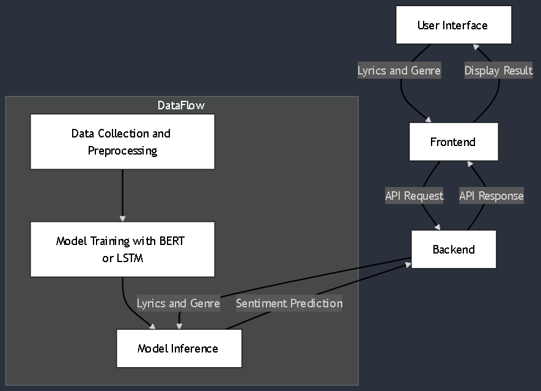

# Music Composition Analyzer

## Project Overview
This model aims to predict the Genre of a song uploaded and aims to predict sentiments. 

## Features
- Upload an audio and model will predict it's top 3 Genre possibilities


## Architecture
The architecture of the Music Composition Advisor is designed to facilitate seamless data flow from user input through to model inference and output. Below is a high-level view of the architecture:




### Components
- **User Interface**: The front-end where users can upload an audio mp3 file.
- **Frontend**: Built using React to handle user interactions and API requests.
- **Backend**: A server that processes requests, manages data, and interfaces with the machine learning model.
- **Model Inference**: The core component that applies trained models to analyze audio and provide predictions.
- **Data Collection and Preprocessing**: Handles the collection of lyrics data and prepares it for model training.

### Data Collection
- **Misc** folder contains the files used in Data Collection and preprocessing.
- cleanupGenres.py - to clean up sub-genres and club them into a single genre for simplicity
- Download.py - will use spotipy(spotify library) to search the songs and add them into a playlist.
- MapFileNameandPath.py - will implement Fuzzy logic to map file names and add against the title of csv and update the csv file.


### Training
- implemented separate audio training using simple Deep learning principles.
#### Components
- AudioDataset: A custom PyTorch Dataset class that loads audio files, computes mel spectrograms, and performs genre encoding.
- AudioClassifier: A neural network model that uses CNNs with residual connections for learning features from mel spectrograms.
- AudioTrainer: A class that trains the model, validates performance, and includes data augmentation and mixed precision training

### Model Architecture (`AudioClassifier`)
1. **Convolutional Layers**: Three CNN layers with increasing filter sizes (64, 128, 256), each followed by batch normalization, LeakyReLU activation, and dropout.
2. **Residual Connections**: For second convolutional block, adds identity mapping to improve gradient flow.
3. **Global Average Pooling (GAP)**: Reduces spatial dimensions to 1x1, outputting a feature vector.
4. **Fully Connected Layers**: Two linear layers (512 and output size) with dropout.

### Training Procedure (`AudioTrainer`)
- **Data Augmentation**: Time and frequency masking to improve generalization.
- **Mixed Precision Training**: Uses `torch.cuda.amp` for faster computations.
- **Gradient Clipping**: Limits gradients to prevent exploding gradients.
- **Early Stopping**: Terminates training if validation loss does not improve.

### Training Loop
1. **Initialize Model**: Set device, define model, loss function (`CrossEntropyLoss`), and optimizer (`AdamW`).
2. **Train**: For each epoch, run `train_epoch` (batch loss, backpropagation, logging) and validation steps.
3. **Logging and Checkpointing**: Saves best model based on validation loss and logs metrics using TensorBoard.


### Backend
- using python to run an API that will allow frontend to upload an audio file and predict the Genre.


### Frontend
- Using React to allow user to uplaod an mp3 file and shows top 3 predictions


## Installation and usage
- pip install torch torchaudio librosa pandas matplotlib scikit-learn tensorboard
- run audio_text_Train.py to train your own model
- run api.py to run the backend API, localhost:5000

## Usage
1. Start the backend server:
   ```bash
   python backend/api.py
   ```

2. Run the frontend application:
   ```bash
   npm install
   npm start
   ```

3. Open your browser and go to `http://localhost:3000` to access the Music Sentiment Analyzer.

## Contributing
We welcome contributions! Please fork the repository and submit a pull request with your changes.

## Acknowledgements
- Thanks to all contributors for their valuable input.
- Special thanks to the resources that provided guidance on machine learning and web development.