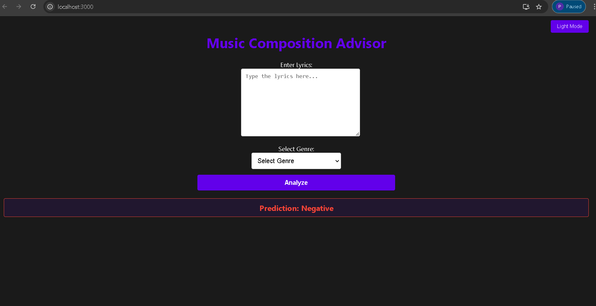

---

# Music Composition Advisor - Frontend

This is the frontend application for the **Music Composition Advisor** project. The application allows users to input song lyrics and select a genre, which is then analyzed by an AI model to predict the sentiment (positive or negative) impact of the song. This frontend is built using **React** and provides a clean, user-friendly interface with a dark mode option.

---

## Table of Contents

- [Features](#features)
- [Architecture](#architecture)
- [Setup Instructions](#setup-instructions)
- [Usage](#usage)
- [Customization](#customization)
- [Technologies Used](#technologies-used)

---

## Features

- **Lyrics Input**: Text area to input song lyrics.
- **Genre Selection**: Dropdown to choose the genre.
- **Analyze Button**: Sends lyrics and genre data to the backend for analysis.
- **Sentiment Display**: Shows the sentiment result (positive or negative) with specific colors.
- **Dark Mode**: Toggle button to switch between light and dark themes.
- **Dynamic Styling**: Colors for the prediction result based on sentiment (green for positive, red for negative).

---

## Architecture

The frontend application communicates with the backend through an API to send lyrics and genre data and receive sentiment predictions.

### Architecture Diagram


---

## Setup Instructions

To set up and run the frontend application locally, follow these steps:

### Prerequisites

- Node.js (version 14 or higher)
- NPM (Node Package Manager)

### Installation

1. **Clone the repository**:
   ```bash
   git clone <your-repo-url>
   cd music-composition-advisor-frontend
   ```

2. **Install dependencies**:
   ```bash
   npm install
   ```

3. **Set up environment variables** (if applicable):
   - No specific environment variables are needed by default, but if the backend API URL is different, you can modify it in the API request section of `App.js`.

4. **Start the development server**:
   ```bash
   npm start
   ```

5. **Open your browser**:
   - Go to `http://localhost:3000` to view the app in development mode.

---

## Usage

1. **Enter Lyrics**: Type or paste lyrics in the provided text area.
2. **Select Genre**: Choose a genre from the dropdown menu.
3. **Analyze**: Click the "Analyze" button to send the data to the backend.
4. **View Prediction**: The sentiment result will display below, with green for positive and red for negative outcomes.
5. **Toggle Theme**: Use the button in the top-right corner to switch between light and dark themes.

---

## Customization

To customize the styling of the frontend, modify the `App.css` file:

- **Dark Mode Color**: Adjust `--dark-bg` and `--dark-text` in `App.css` for a different dark theme color.
- **Result Colors**: Change `--positive-color` and `--negative-color` in `App.css` to customize the colors for positive and negative results.
- **Toggle Button**: Modify the `.toggle-button` class in `App.css` to change the appearance of the light/dark mode toggle button.

---

## Technologies Used

- **React**: JavaScript library for building user interfaces.
- **CSS**: Styling for the application, including custom themes and responsive layout.
- **Axios**: Used to send API requests to the backend.
- **React Hooks**: State and effect management for theme and data handling.

---

## Frontend Screenshot
After successfully running npm start, frontend will look like this



---

## Contributing

Feel free to contribute to this project by opening issues or submitting pull requests. All contributions are welcome!

---